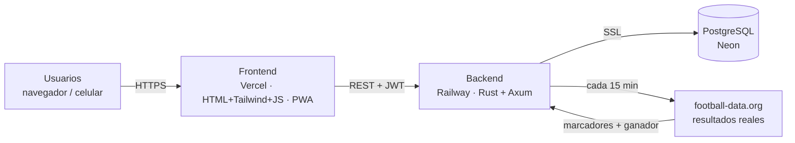
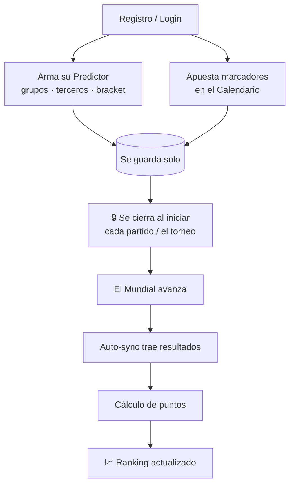
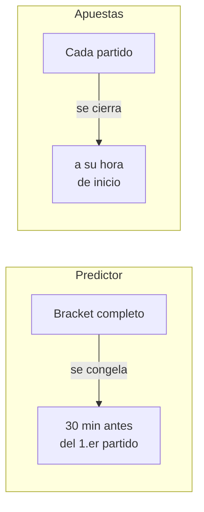
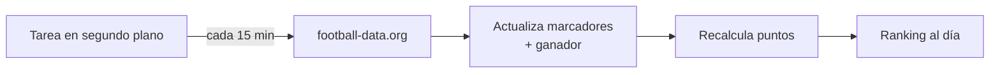
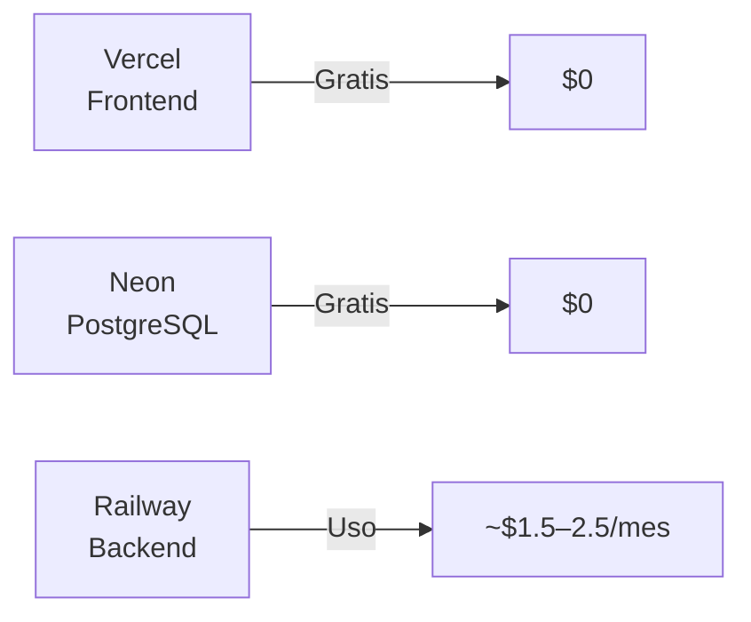

<!--
  CONTENIDO PARA GAMMA AI
  Cómo usarlo: Gamma (gamma.app) → Create new → "Paste in text" / Import →
  pega TODO este contenido. Cada bloque separado por "---" es una diapositiva.
  Los bloques ```mermaid se renderizan como diagramas.
  Tono sugerido: profesional, deportivo, moderno. Acento naranja (#FF6B00) sobre azul noche (#0E1E47).
-->

# Conecta · Predictor Copa FIFA 2026

### La polla mundialista corporativa, full-stack y en producción

Plataforma web para que ~1,500 colaboradores predigan la Copa FIFA 2026, apuesten
marcadores y compitan en un ranking que se actualiza **solo**.

`Rust` · `PostgreSQL` · `PWA` · `Vercel + Railway + Neon`

---

# El reto

Organizar una polla del Mundial para **toda la empresa** sin hojas de cálculo ni
conteo manual.

- 📊 **1,500+ usuarios** prediciendo en simultáneo
- ⚽ **104 partidos**, 48 equipos, 12 grupos
- 🧮 Puntaje **automático** con resultados reales
- ⏱️ Reglas justas: nadie cambia su predicción después del pitazo
- 💸 Presupuesto mínimo de infraestructura

---

# Qué hace la app

- 🏆 **Predictor**: arma tu Mundial completo (grupos + terceros + bracket hasta el campeón)
- 📅 **Calendario**: apuesta el marcador exacto de cada partido
- 🎯 **Puntaje automático** con datos reales (football-data.org)
- 📈 **Ranking** en vivo con criterios de desempate
- 👤 **Mis Apuestas**: tu resumen personal de puntos
- 🛠️ **Panel admin**: gestión y carga manual de resultados
- 📱 **PWA**: instalable en el celular como app

---

# Dos formas de jugar

| | 🏆 Predictor | 📅 Apuestas por partido |
|---|---|---|
| **Qué predices** | Todo el torneo: grupos, terceros, bracket, campeón | El marcador de cada partido |
| **Cierre** | Una vez, 30 min antes del 1.er partido | Cada partido, a su hora de inicio |
| **Puntúa con** | Bonus por aciertos | 10 / 7 / 5 / 2 / 0 |

Ambas son independientes y **suman al total**.

---

# Arquitectura



- **Frontend** estático (escala infinito en CDN)
- **Backend** Rust: rapidísimo y liviano en memoria
- **Base de datos** gestionada y gratuita

---

# Stack tecnológico

- **Backend:** Rust · Axum · SQLx · JWT · Argon2
- **Base de datos:** PostgreSQL (Neon)
- **Frontend:** HTML + Tailwind CSS + JavaScript vanilla (sin build)
- **PWA:** instalable, con service worker (offline básico)
- **Despliegue:** Vercel (front) · Railway (back) · Neon (BD)
- **Datos reales:** API de football-data.org

> Sin frameworks pesados: carga rápida, mantenimiento simple.

---

# Flujo del usuario



---

# Sistema de puntaje — por partido

Igual en toda fase. Cada partido finalizado puntúa cada apuesta:

| Pts | Categoría | Condición | Ejemplo |
|---|---|---|---|
| **10** | Marcador exacto | Goles exactos de ambos | 2-1 vs 2-1 |
| **7** | Diferencia de goles | Mismo ganador + misma diferencia | 3-1 vs 2-0 |
| **5** | Resultado simple | Acierta el ganador / empate | 2-0 vs 1-0 |
| **2** | Consolación | Goles exactos de un equipo | 1-1 vs 1-3 |
| **0** | Error total | Nada coincide | 2-0 vs 0-1 |

---

# Sistema de puntaje — el Predictor

El bracket también suma, al compararse con lo que realmente pasa:

- 🏆 **Campeón correcto** → +25
- 🥈 **Cada finalista** → +10
- 🥇 **1.º de cada grupo** → +5
- ✅ **Cada clasificado top-2** → +3
- 🟫 **Cada mejor tercero** → +2

> Las tablas de grupos y el campeón se calculan de los **resultados reales**
> (el campeón usa el ganador oficial, incluso por penales).

---

# Reglas justas: bloqueos por tiempo

Validados en el **servidor** (nadie los esquiva):



- 🔒 El **bracket** se congela una vez, antes del arranque
- 🔒 Cada **apuesta** se cierra cuando empieza su partido

---

# Todo automático: sincronización



- Corre **al arrancar y cada 15 minutos**
- Trae marcador y **ganador real** de cada partido
- Si la API falla un partido → el admin lo **carga a mano**

---

# Ranking y desempates

Orden por **puntos totales**. En caso de empate:

1. 🥇 Más marcadores **exactos** (10 pts)
2. 🎯 Más aciertos de **diferencia** (7 pts)
3. ✅ Más **resultados simples** (5 pts)
4. ⏱️ **Registro más antiguo**

- Podio (top 3) + tabla completa + tu posición
- Conteos **pre-calculados** → el tablero abre al instante

---

# Panel de administración

Solo para administradores (rol por configuración):

- 🔄 **Sincronizar** y **recalcular** con un clic
- 👥 **Gestión de usuarios** (ver / eliminar)
- ✍️ **Carga manual de resultados** (respaldo si la API falla)

> El admin se define por variable de entorno: cero asignaciones a mano.

---

# Seguridad

- 🔐 Contraseñas con **Argon2** (nunca en texto plano)
- 🎫 Sesión con **JWT** (sin cookies → sin CSRF)
- 🛡️ **CORS** restringido al dominio del frontend
- 🚧 **Rate limiting** en login (5 intentos/min)
- 📋 Cabeceras de seguridad (HSTS, X-Frame-Options, nosniff…)
- 🔒 Base de datos por **SSL**

---

# Pensada para escala

Optimización del cálculo de puntos para **1,500+ usuarios**:

| | Antes | Ahora |
|---|---|---|
| Queries por recálculo | **~110,000** | **~6** |
| Tiempo | ~60–90 s | **~50–100 ms** |

- Scoring en **lote con SQL** (no una query por apuesta)
- Índices + conteos materializados
- Resultado: el recálculo es **instantáneo**

---

# Costo de infraestructura



- Frontend y base de datos: **gratis**
- Solo se paga el backend: **~$1.5–2.5/mes**
- El Mundial completo (~6 semanas) entra en **$5**

---

# Números clave

- ⚽ **104** partidos · **48** equipos · **12** grupos
- 👥 **1,500+** usuarios soportados
- 🧮 **5** categorías de puntaje + **5** bonus del predictor
- 🔄 Sync cada **15 min**, 100% automático
- ⚡ Recálculo **~110,000 → 6** queries
- 💸 **~$5** por todo el torneo

---

# Resultado

Una **polla mundialista full-stack, real, segura y económica** — lista para que
toda la empresa juegue la Copa FIFA 2026.

- ✅ En producción (Vercel + Railway + Neon)
- ✅ Puntaje y ranking automáticos
- ✅ Justa (bloqueos por tiempo) y segura
- ✅ Escala a 1,500+ usuarios dentro de presupuesto

### ⚽ ¡Listo para el pitazo inicial!
