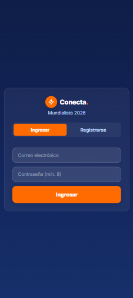
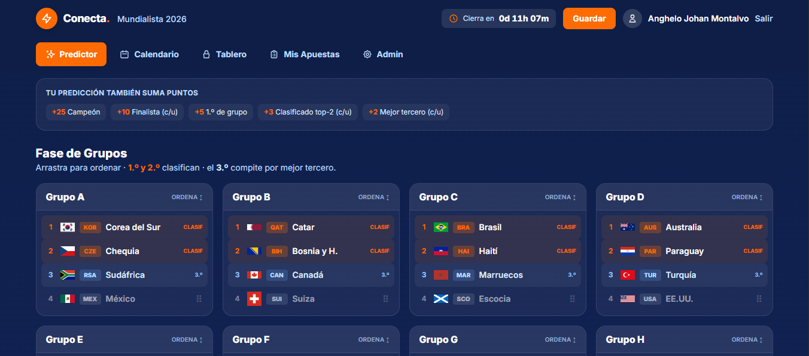
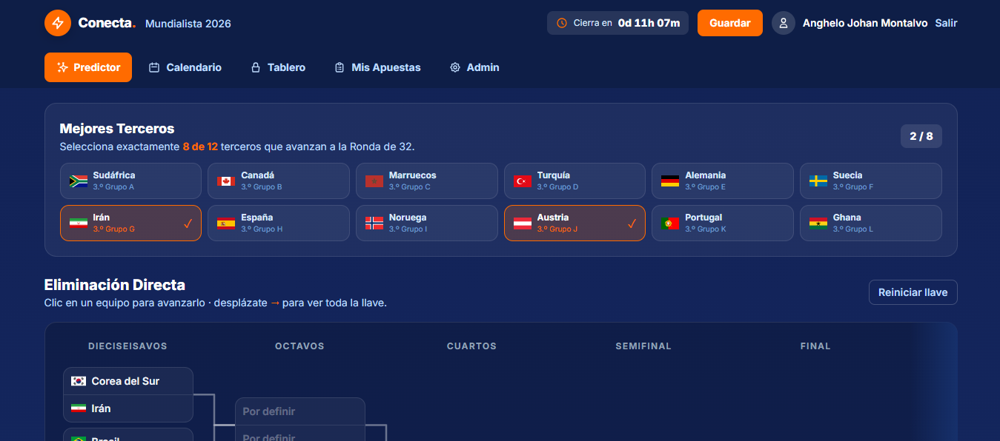
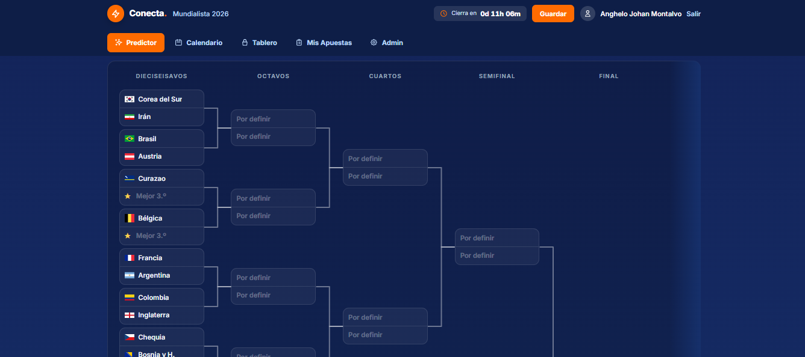
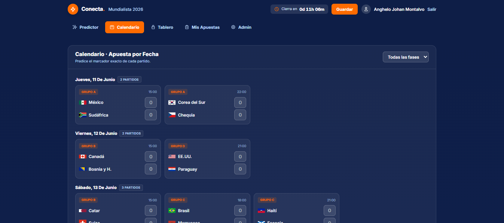

<!--
  GUÍA DEL USUARIO — CONTENIDO PARA GAMMA AI
  Cómo usarlo: gamma.app → Create new → "Paste in text" → pega TODO este contenido.
  Cada bloque separado por "---" es una diapositiva.
  Incluye una captura (login). Al pegar en Gamma, súbela manualmente en ese slide.
  Tono: amigable, motivador, para colaboradores (no técnico).
  Colores de marca: naranja #FF6B00 sobre azul noche #0E1E47. Estilo deportivo y festivo. ⚽
-->

# 🏆 Conecta Mundialista 2026

### ¡Demuestra que sabes de fútbol y gana!

Bienvenido a la quiniela mundialista de la empresa. Arma tu Mundial, predice los
marcadores y compite con todos tus compañeros por el primer lugar.

*Una guía rápida para empezar a jugar.*

---

# ¿De qué se trata?

Es muy simple: **predices lo que crees que va a pasar en el Mundial** y ganas
puntos según le atines.

- ⚽ Predice los resultados de los **104 partidos**
- 🏆 Arma tu **bracket** hasta el campeón
- 📈 Sube en el **ranking** contra toda la empresa
- 🎉 El que más puntos acumule, **gana**

> No necesitas ser experto: ¡todos tienen chance!

---

# Hay 2 formas de sumar puntos

| 🏆 El Predictor | 📅 Las Apuestas |
|---|---|
| Predices **todo el torneo**: quién pasa de cada grupo y quién llega a la final | Predices el **marcador exacto** de cada partido |
| Lo armas **una vez**, antes de que arranque el Mundial | Vas apostando partido por partido |

**Las dos suman a tu puntaje total.** ¡Juega las dos para ganar más!

---

# Cómo empezar — Paso 1: Regístrate

1. Entra al enlace de la quiniela (te lo compartimos)
2. Crea tu cuenta con tu **nombre, correo y una contraseña**
3. ¡Listo! Compites de forma **individual** con tu nombre

> Tu contraseña debe tener al menos **8 caracteres**.

---

# Paso 2: Ordena los grupos 🏆

En la pestaña **Predictor** ordenas los 12 grupos como crees que quedarán.

- Arrastra los equipos (en el celular usa las flechas ▲▼)
- El **1.º y 2.º** de cada grupo avanzan directo
- Acomódalos del 1.º al 4.º según tu pronóstico

---

# Paso 3: Elige los mejores terceros

No solo pasan los primeros dos de cada grupo: también avanzan los **8 mejores
terceros lugares**.

- Marca los **8 grupos** cuyo tercer lugar crees que clasificará
- Esos equipos entran al bracket

---

# Paso 4: Completa el bracket hasta el campeón

Llena la llave de eliminación: octavos, cuartos, semifinal y **la gran final**.

- Ve eligiendo quién avanza en cada ronda
- Al final, **corona a tu campeón** 🏆

> Se guarda solo. Verás un "Guardado ✓" cada vez.

---

# Paso 5: Apuesta los marcadores 📅

En la pestaña **Calendario** predices el resultado exacto de cada partido.

- Escribe los goles de cada equipo (ej. **2 - 1**)
- Se guarda automáticamente
- Puedes cambiarlo… **hasta que empiece el partido**

---

# ⏰ ¡Ojo con los cierres!

Para que sea justo, las predicciones se **cierran a tiempo**:

- 🔒 **Tu Predictor (el bracket)** se congela **30 minutos antes** del primer
  partido del Mundial. Después ya no se puede cambiar.
- 🔒 **Cada apuesta de marcador** se cierra **cuando ese partido empieza**.

> Consejo: ¡no lo dejes para el último minuto!

---

# ¿Cómo gano puntos por partido?

Según qué tan cerca quedes del resultado real:

| Puntos | Si aciertas… |
|---|---|
| **10** 🎯 | El marcador **exacto** |
| **7** | El ganador **y** la diferencia de goles |
| **5** | Solo quién gana (o el empate) |
| **2** | Los goles exactos de **un** equipo |
| **0** | Nada |

---

# Ejemplos de puntaje ⚽

**Resultado real: México 2 – 1 Canadá**

- Predijiste **2 – 1** → 🎯 **10 puntos** (exacto)
- Predijiste **3 – 2** → **7 puntos** (gana México por 1, igual que el real)
- Predijiste **1 – 0** → **5 puntos** (acertaste que gana México)
- Predijiste **2 – 3** → **2 puntos** (acertaste los 2 goles de México)
- Predijiste **0 – 1** → **0 puntos** (no coincide nada)

---

# Puntos EXTRA con tu Predictor 🏆

Tu bracket también suma cuando aciertas:

- 🏆 **Campeón correcto** → +25 puntos
- 🥈 **Cada finalista** (los 2 de la final) → +10
- 🥇 **1.º de cada grupo** → +5
- ✅ **Cada equipo que clasifica (top 2)** → +3
- 🟫 **Cada mejor tercero** que le atines → +2

> Acertar el campeón vale muchísimo: ¡piénsalo bien!

---

# El Tablero (ranking) 📈

Mira en qué lugar vas contra toda la empresa.

- 🥇🥈🥉 Podio con los 3 primeros
- Tu posición resaltada
- Se actualiza **solo**, conforme terminan los partidos

---

# ¿Y si hay empate en puntos?

Gana quien tenga (en este orden):

1. 🎯 Más marcadores **exactos** (de 10 puntos)
2. Más aciertos de **diferencia** (de 7 puntos)
3. Más **resultados simples** (de 5 puntos)
4. ⏱️ Quien se **registró primero**

> Por eso conviene apuntar a marcadores exactos. ¡Arriésgate!

---

# Mis Apuestas 👤

Tu resumen personal en un solo lugar:

- Tu **posición** y tus **puntos totales**
- Cuántos exactos, diferencias y simples llevas
- El **detalle de cada apuesta** y los puntos que te dio

---

# 📱 Instálala en tu celular

Para tenerla a la mano como una app:

- **Android (Chrome):** menú ⋮ → "Instalar app" / "Agregar a pantalla de inicio"
- **iPhone (Safari):** botón Compartir → "Agregar a inicio"

> Se abre como app, sin barras del navegador. ¡Cómodo y rápido!

---

# Consejos para ganar 💡

- ✅ Llena **todo**: el bracket y los marcadores. Más predicciones = más puntos.
- 🎯 Atrévete a poner marcadores **exactos** (valen 10 y desempatan).
- 🏆 Piensa bien tu **campeón**: vale +25.
- ⏰ Haz tus apuestas **con tiempo**, antes de cada cierre.
- 🔁 Revisa el **calendario** seguido para no perder partidos.

---

# Preguntas frecuentes ❓

**¿Puedo cambiar mi predicción?**
Sí, hasta que cierre (el bracket antes del 1.er partido; cada marcador, al iniciar ese partido).

**¿Cuándo veo mis puntos?**
Se calculan solos cuando terminan los partidos. Revisa el Tablero.

**¿Necesito saber mucho de fútbol?**
No. ¡La suerte y la intuición también cuentan!

---

# ⚽ ¡A jugar!

Arma tu Mundial, apuesta tus marcadores y demuestra quién manda en la oficina.

### Que gane el mejor pronosticador 🏆

*Entra, regístrate y empieza ahora.*
